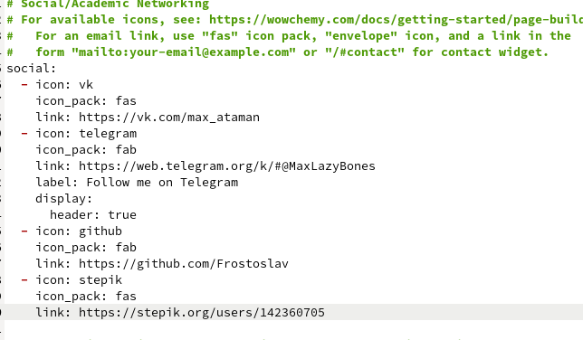
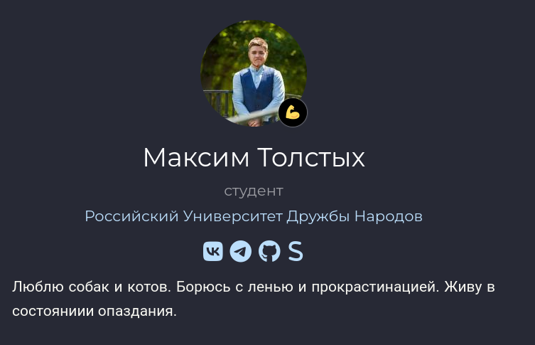
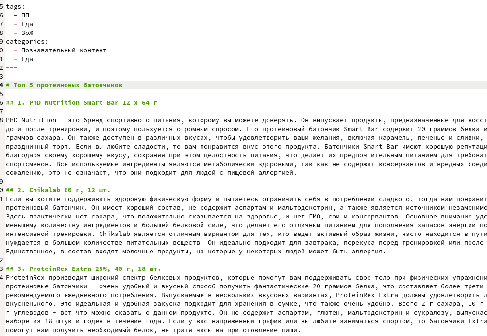
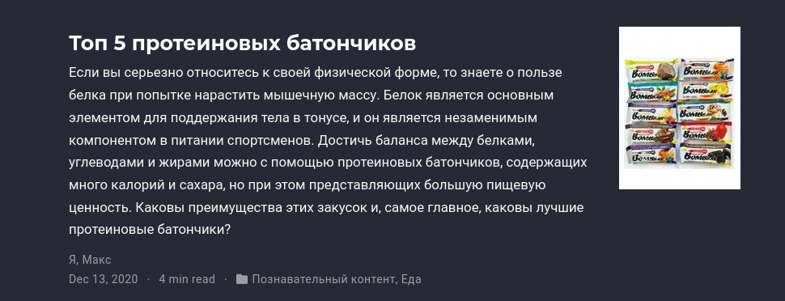
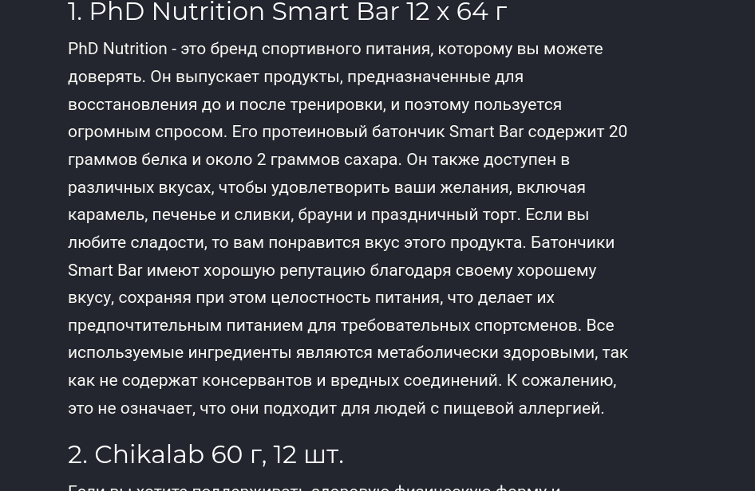
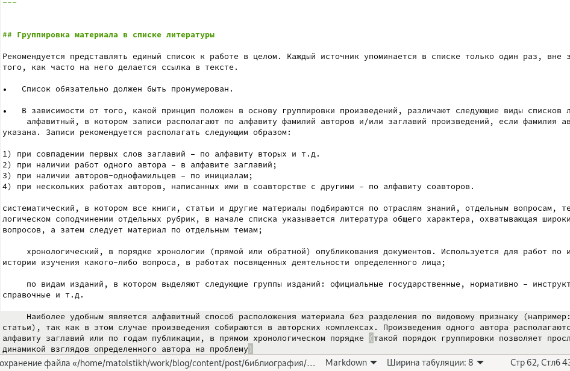
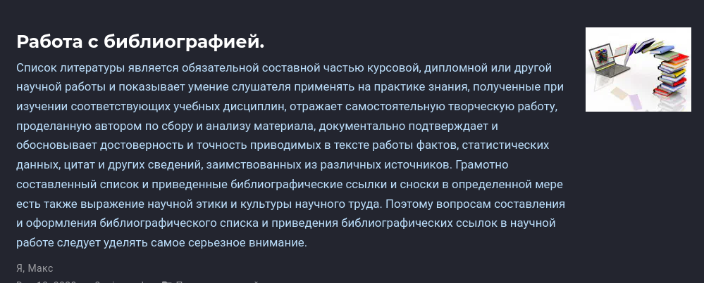
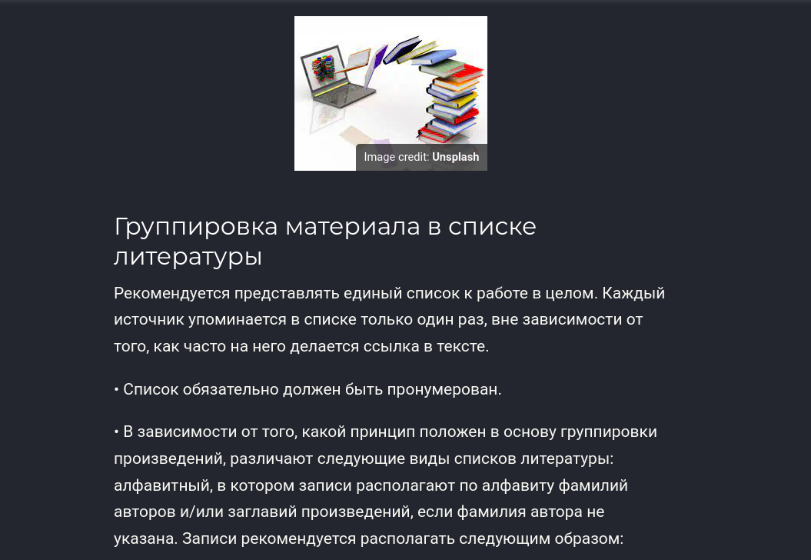

---
## Front matter
lang: ru-RU
title: Hugo
subtitle: Четвёртый этап индивидуального проекта
author:
  - Толстых М. А.
institute:
  - Российский университет дружбы народов, Москва, Россия
date: 29 апреля 2023

## i18n babel
babel-lang: russian
babel-otherlangs: english

## Formatting pdf
toc: false
toc-title: Содержание
slide_level: 2
aspectratio: 169
section-titles: true
theme: metropolis
header-includes:
 - \metroset{progressbar=frametitle,sectionpage=progressbar,numbering=fraction}
 - '\makeatletter'
 - '\beamer@ignorenonframefalse'
 - '\makeatother'
backgroundColor: orange
---

# Информация

## Докладчик

:::::::::::::: {.columns align=center}
::: {.column width="60%"}

  * Толстых Максим Алексеевич
  * студент 1 курса, группа НММбд-03-22
  * Российский университет дружбы народов

:::
::: {.column width="40%"}

:::
::::::::::::::

# Вводная часть

## Объект и предмет исследования

- Hugo
- Github pages

## Цель работы

- Выполнить новый этап проекта. Получить новые навыки по созданию сайта.

## Задание
- Зарегистрироваться на соответствующих ресурсах и разместить на них ссылки на сайте.
- Сделать пост по прошедшей неделе.
- Добавить пост на тему по выбору.

# Выполнение четвёртого этапа индивидуального проекта

## Добавление ссылок

:::::::::::::: {.columns align=center}

::: {.column width="45%"}

:::

::: {.column width="45%"}

:::

::::::::::::::

## Пост недели.

:::::::::::::: {.columns align=center}

::: {.column width="30%"}

:::

::: {.column width="30%"}

:::

::: {.column width="30%"}

:::

::::::::::::::

## Пост по выбору.

:::::::::::::: {.columns align=center}

::: {.column width="30%"}

:::

::: {.column width="30%"}

:::

::: {.column width="30%"}

:::

::::::::::::::

# Результаты

## Выводы из третьего этапа индивидуального проекта

В ходе выполнения первого этапа индивидуального проекта были изучены способы изменения информации на сайте и создания постов.

