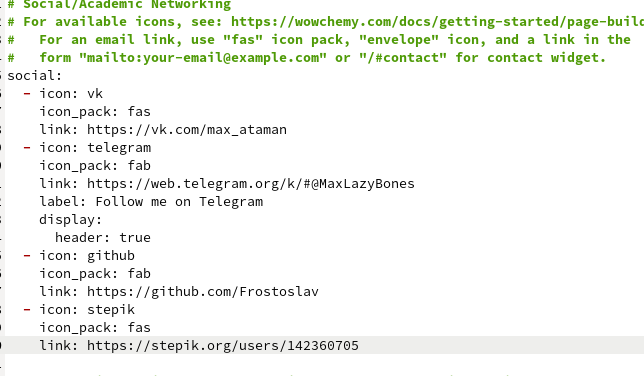
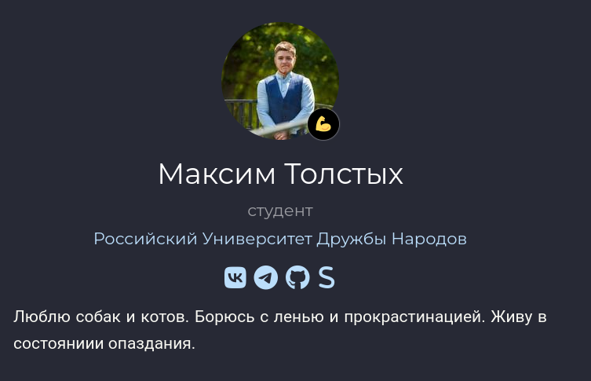
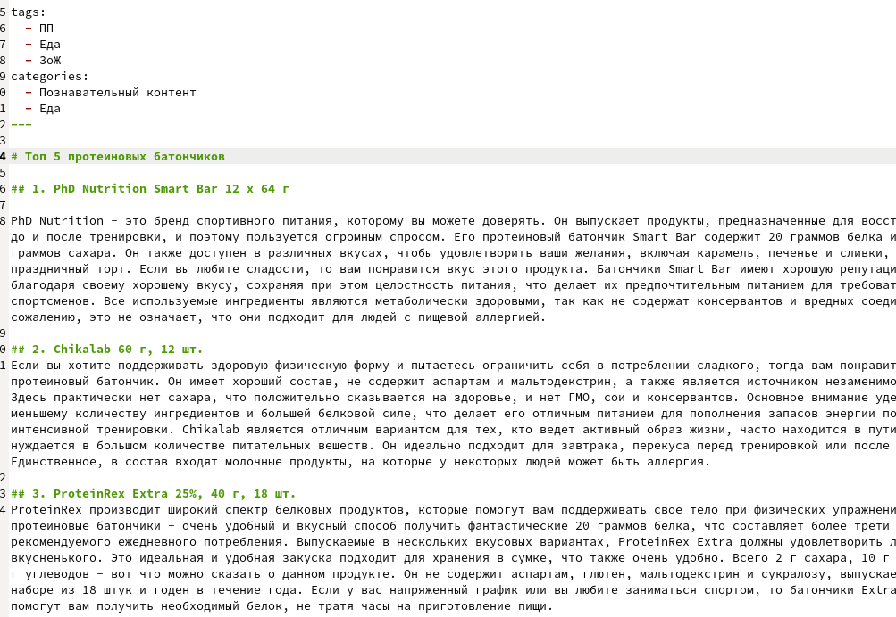
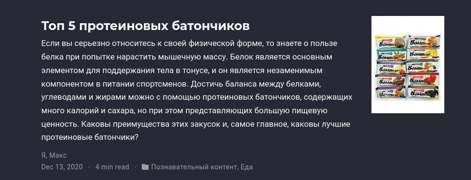
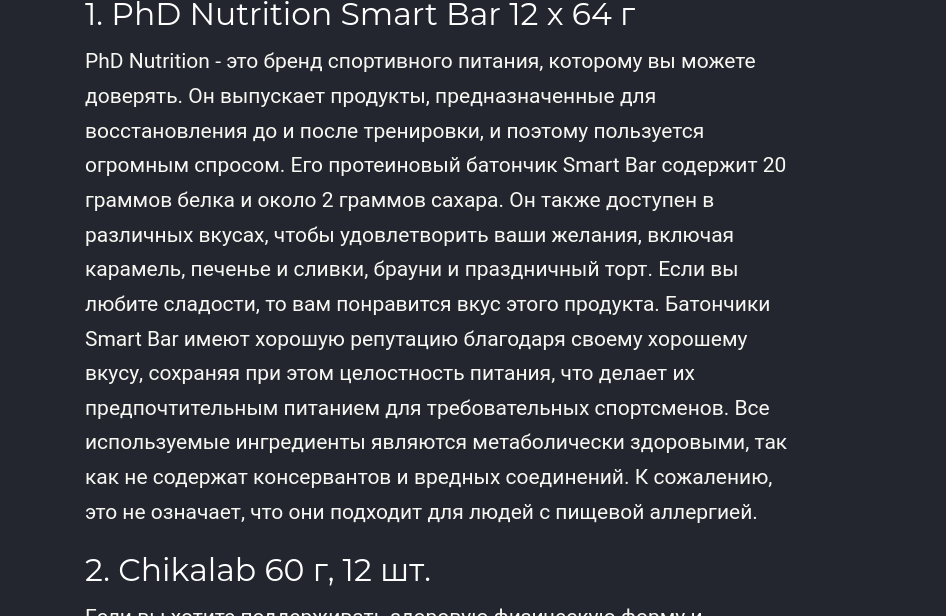
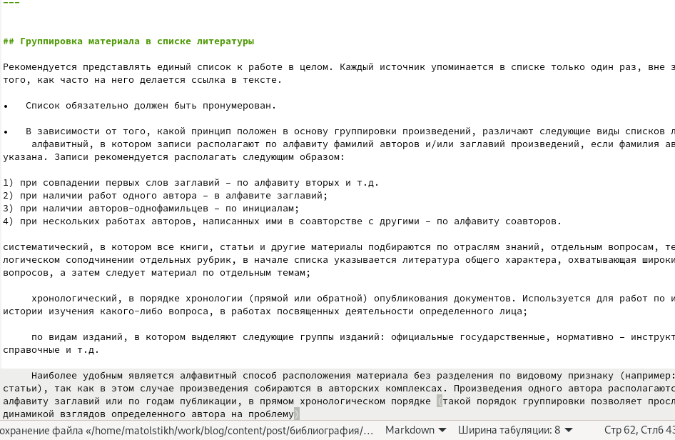
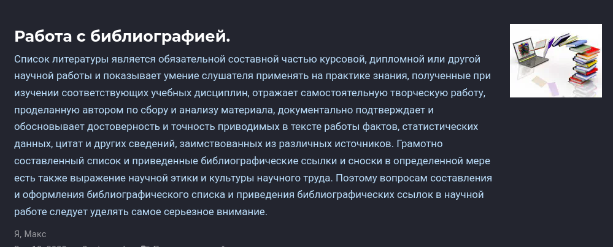
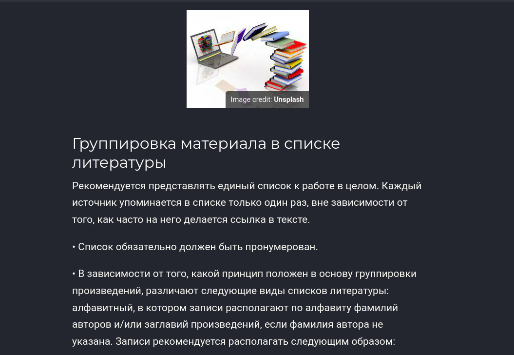

---
## Front matter
title: "Отчёт по четвертому этапу индивидуального проекта"
subtitle: "Операционные системы"
author: "Толстых Максим Алексеевич"

## Generic otions
lang: ru-RU
toc-title: "Содержание"

## Bibliography
bibliography: bib/cite.bib
csl: pandoc/csl/gost-r-7-0-5-2008-numeric.csl

## Pdf output format
toc: true # Table of contents
toc-depth: 2
lof: true # List of figures
fontsize: 12pt
linestretch: 1.5
papersize: a4
documentclass: scrreprt
## I18n polyglossia
polyglossia-lang:
  name: russian
  options:
	- spelling=modern
	- babelshorthands=true
polyglossia-otherlangs:
  name: english
## I18n babel
babel-lang: russian
babel-otherlangs: english
## Fonts
mainfont: PT Serif
romanfont: PT Serif
sansfont: PT Sans
monofont: PT Mono
mainfontoptions: Ligatures=TeX
romanfontoptions: Ligatures=TeX
sansfontoptions: Ligatures=TeX,Scale=MatchLowercase
monofontoptions: Scale=MatchLowercase,Scale=0.9
## Biblatex
biblatex: true
biblio-style: "gost-numeric"
biblatexoptions:
  - parentracker=true
  - backend=biber
  - hyperref=auto
  - language=auto
  - autolang=other*
  - citestyle=gost-numeric
## Pandoc-crossref LaTeX customization
figureTitle: "Рис."
tableTitle: "Таблица"
listingTitle: "Листинг"
lofTitle: "Список иллюстраций"
lolTitle: "Листинги"
## Misc options
indent: true
header-includes:
  - \usepackage{indentfirst}
  - \usepackage{float} # keep figures where there are in the text
  - \floatplacement{figure}{H} # keep figures where there are in the text
---

# Цель работы
- Выполнить новый этап проекта. Получить новые навыки по созданию сайта.

# Задание
- Зарегистрироваться на соответствующих ресурсах и разместить на них ссылки на сайте.
- Сделать пост по прошедшей неделе.
- Добавить пост на тему по выбору.

# Выполнение четвертого этапа индивидуального проекта

## Добавление ссылок

1. Вместо данных новых ресурсов были добавлены ссылки на степик, Вк, телеграмм и гитхаб. Для этого перешли в папку "content" -> "authors" -> "admin" и в файле изменяем информацию.(рис. [-@fig:001]), (рис. [-@fig:002])

{ #fig:001 width=70%}

{ #fig:002 width=70%}

## Новые посты

Добавили пост недели и пост по выбору. Перешли в папку “contents”
-> “post” и добавили необходимую информацию. (рис. [-@fig:003]), (рис. [-@fig:004]), (рис. [-@fig:005]), (рис. [-@fig:006]), (рис. [-@fig:007]), (рис. [-@fig:008])

{ #fig:003 width=70%}

{ #fig:004 width=70%}

{ #fig:005 width=70%}

{ #fig:006 width=70%}

{ #fig:007 width=70%}

{ #fig:008 width=70%}

4. Загрузили все изменения на гитхаб.

# Выводы

В ходе выполнения первого этапа индивидуального проекта были изучены способы изменения информации на сайте и создания постов.
